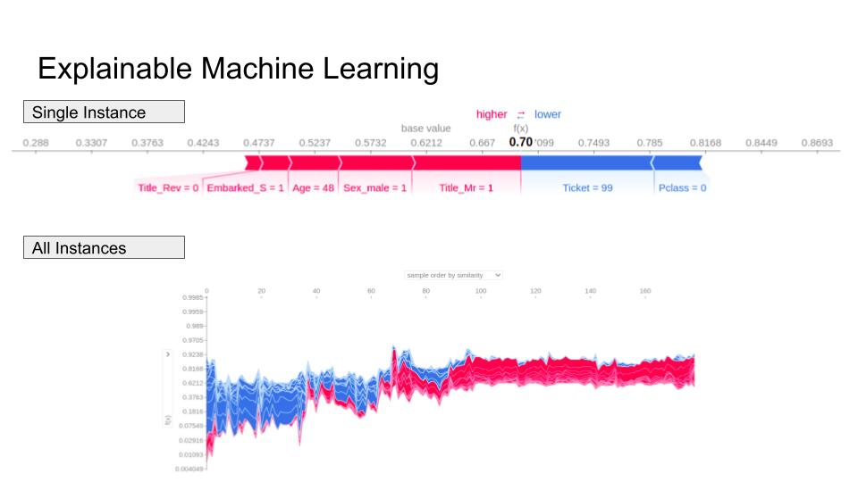

# MLOps
This repo describes a reproducible machine learning pipeline that can be used in both local machine and AWS SageMaker for model training. This allows for quick prototyping of different SKLearner classifiers such as Logistic Regression, DecisionTree or RandomForest and within an AWS environment.  

Besides getting reproducible machine learning pipelines, it is important to explain the machine learning prediction via metrics like Shapley values. This also helps users of machine learning models to better explain their model predictions. 

# Machine Learning Pipeline Architecture
The architecture gives an overview on how the code repo could be reproduced. 


The code directory is as follows:
```
├── README.md          <- The top-level README for developers using this project.
├── data
│   ├── processed      <- The final, canonical data sets for modeling.
│   └── raw            <- The original, immutable data dump.
│
├── docs               <- The list of images and other documents that describe the repo
├── Dockerfile         <- This would be used to generate the docker image and container for model training in AWS 
│
├── model_checkpoint   <- Trained models
│
├── notebooks          <- Jupyter notebook contains information about Explainable ML 
├── requirements.txt   <- The requirements file for reproducing the analysis environment, e.g.
│                         generated with `pip freeze > requirements.txt`
└── src                <- Source code for use in this project.
    ├── __init__.py    <- Makes src a Python module
    │
    ├── config.py      <- Contains the configurations for data paths, model hyperparameters and others
    │
    ├── data_pipeline.py <- Codes to create a preprocessor for turning raw data into features for modeling
    │
    ├── inference.py   <- Codes to use trained models to make predictions
    │
    ├── model.py       <- Codes to create models
    │
    ├── preprocess.py   <- Codes to turn raw data into features for modeling
    │
    └── train.py  <- Codes to train the models

```

# Explainable Machine Learning
With the use SHAP, the machine learning prediction could be better explained based on a single or all instances by looking at how the features affect the average prediction. 
The direction (i.e. +/-) and magnitude of effect of each feature is studied here. 


# Getting Started - Local!
1. Get the repo into your preferred directory: `git clone https://github.com/tankwanchet/mlops.git`
2. Install required packages: `pip install -r requirements.txt`
3. Run the machine learning pipeline in the local machine, run `main_local.py` 

# Getting Started - AWS SageMaker!
1. Start a notebook instance (see this link for more info: https://docs.aws.amazon.com/sagemaker/latest/dg/gs-setup-working-env.html)
2. Get the repo into your preferred directory: `git clone https://github.com/tankwanchet/mlops.git`
3. Install required packages: `pip install -r requirements.txt`
4. Run the machine learning pipeline in AWS SageMaker, run `main.py`


# References
- https://github.com/slundberg/shap
- https://github.com/aws/sagemaker-containers#sm-model-dir
- https://docs.aws.amazon.com/sagemaker/latest/dg/model-checkpoints.html
- https://stackoverflow.com/questions/69024005/how-to-use-sagemaker-estimator-for-model-training-and-saving